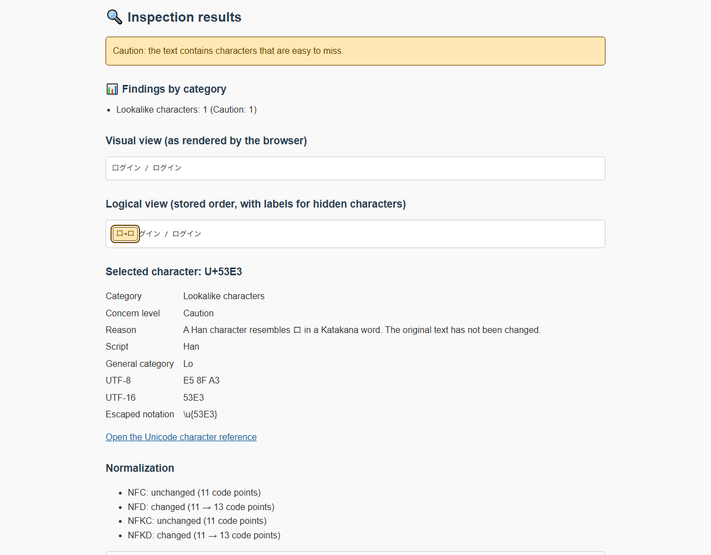
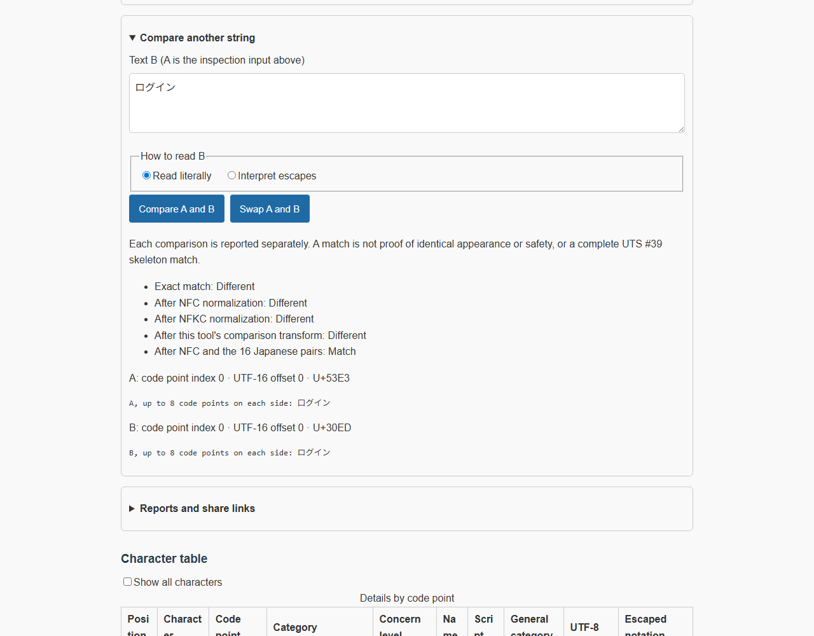

# WeirdString Inspector - Unicode Anomaly Character Detector


[](https://ipusiron.github.io/weirdstring-inspector/)

**Day023 - 100 Security Tools with Generative AI**

English · [日本語](README.md)

Inspect invisible characters, look-alikes and Unicode controls without uploading your text.
WeirdString Inspector compares browser-rendered appearance with logical character order, explains findings, and offers explicit comparison, removal and export actions.
It is an educational inspection tool, not a proof that a string is safe or malicious.

## 🌐 Live demo

[Open WeirdString Inspector](https://ipusiron.github.io/weirdstring-inspector/)

## 📸 Screenshots


> *The Han character 口 is identified as a possible look-alike of Katakana ロ in context.*


> *口グイン and ログイン match only after the separate Japanese-pair transform.*

## ✨ Features

- 12 categories with High concern, Caution and Information levels
- Rendered and logical views, selectable character details, UTF-8/UTF-16 and script information
- Tag and variation-selector decoding candidates; token/script checks and normalization previews
- Independent exact, NFC, NFKC, comparison-transform and Japanese-pair comparisons
- Removal preview that keeps the original input intact
- UTF-8 file input, JSON/Markdown reports and explicit fragment-based share links
- Japanese and English UI, including help, errors, accessibility labels and 47 samples in 11 groups
- Light/dark themes, keyboard operation and a layout verified at 320px and 390px

## 📖 Usage

1. Paste a string, load a sample, or expand **Load a UTF-8 file**.
2. Choose literal input or escape interpretation. Escape mode recognizes forms such as `\u{202E}` and `\r`.
3. Read the concern level, category counts and logical view. Select a character for its explanation.
4. Expand comparison, removal or reports only when needed; review output before copying or downloading.
5. Select **日本語** or **English** in the header. Switching language preserves input, analysis, comparison, removal choices and open panels.

Saved `ja`/`en` preference takes priority; otherwise the first supported language in the browser's language list is used, falling back to English.
Theme and language storage is optional. Input, filenames and findings are not stored.

Tab and Enter operate character details and buttons. Sample tabs support arrow keys, Home and End.
Escape closes help and returns focus. If clipboard access is missing or denied, select the displayed preview and copy manually.
Textareas normalize CR to LF, so file, sample and URL inputs containing CR are loaded in escape mode to preserve their content.

## 📚 Detection categories

| Key | Category | Scope |
|---|---|---|
| tag | Tag characters | Hidden tags; 3 known RGI tag flags are informational, unverified flag-shaped sequences are cautions |
| bidi | Bidirectional controls | Embeddings, overrides and isolates; directional marks |
| variation | Variation selectors | Context-aware single selectors; consecutive runs and restricted distributed decoding candidates |
| invisible | Invisible characters | Zero-width characters, joiners, BOM and related characters, with context exceptions |
| control | Control characters | C0/C1, DEL and lone CR; normal LF/CRLF are preserved |
| whitespace | Special whitespace | Non-ASCII spaces and separators; TAB is informational |
| private | Private-use and noncharacters | Private use, noncharacters and unpaired surrogates |
| zalgo | Stacked combining marks | Long runs or repeated identical combining marks |
| combining | Combining marks | Other combining marks, including ordinary decomposed text |
| compat | Compatibility characters | NFKC mappings to ASCII letters/digits |
| lookalike | Look-alike characters | ASCII-oriented confusables and narrowly scoped Japanese candidates |
| mixed | Mixed scripts | Unexpected script mixtures within a token |

Normal Japanese is not suspicious merely because it contains Han, Hiragana or Katakana.
The separate Japanese table has 16 pairs. Automatic cautions use only 15 Han characters, when a token contains a single Han character adjacent to at least two Katakana letters.
へ/ヘ is comparison-only. 口グイン, ア力ウント and メ一ル demonstrate the automatic rule.
Informational Han IVS or Mongolian FVS does not certify a registered glyph sequence; the full IVD is not bundled.
ASCII-to-ASCII similarities such as `rn`/`m` or `1`/`l` are outside detection scope.

## ⚖️ Comparing and removing

Each comparison is independent. ✓ means a match; — means a difference. Inputs below use escape notation where needed.

| A | B | Exact | NFC | NFKC | Comparison | Japanese |
|---|---|---|---|---|---|---|
| `abc` | `abc` | ✓ | ✓ | ✓ | ✓ | ✓ |
| `café` | `cafe\u{0301}` | — | ✓ | ✓ | — | ✓ |
| `ｆｌａｇ` | `flag` | — | — | ✓ | ✓ | — |
| `f\u{200B}lag.txt` | `flag.txt` | — | — | — | ✓ | — |
| `g\u{043E}\u{043E}gle.com` | `google.com` | — | — | — | ✓ | — |
| `口グイン` | `ログイン` | — | — | — | — | ✓ |
| `へ` | `ヘ` | — | — | — | — | ✓ |
| `rn` | `m` | — | — | — | — | — |
| `a\r\nb` | `a\nb` | — | — | — | — | — |
| `` | `` | ✓ | ✓ | ✓ | ✓ | ✓ |
| `\u{200B}` | `` | — | — | — | ✓ | — |

A match is not proof of identical visual appearance or safety, or a complete UTS #39 skeleton match.
A transform producing an empty string is reported separately. Inputs beyond the analysis limit or containing invalid escape syntax produce an incomplete comparison.

Removal candidates are concerning tag, bidi, variation, invisible and control characters.
Only High concern candidates are initially selected. Ordinary emoji joiners, Han IVS, leading BOM, CRLF/TAB and normal combining marks are not selected by default.
The original is unchanged; only the chosen code point positions are removed. The preview is analyzed again, but harmful content may remain.
Changing input or input mode invalidates previous comparison, removal and export snapshots.

## 📁 UTF-8 files and limits

Files are decoded locally with strict UTF-8 validation. BOM, CRLF, lone CR and NUL are preserved.
Invalid UTF-8 and UTF-16 are rejected without replacing the current input. An edit made while a file is loading prevents the late result from overwriting it.

| Item | Limit |
|---|---|
| Analysis | 100,000 code points |
| Logical view | 5,000 characters |
| Character table | 1,000 rows |
| File input | One UTF-8 file, 1MiB and 100,000 code points |
| Report | 5MiB in UTF-8 |
| Report details | First 1,000 characters, 100 tokens and 100 decoding candidates |
| Share URL | 8,000 ASCII characters |

## 📤 Reports and sharing

Summary-only is the default for JSON and Markdown reports. It contains no original text, filenames, decoded hidden content or per-character details.
Including original text and details is an explicit option: every code point in the analyzed range is escaped, which prevents display spoofing but **does not anonymize the content**.
Review the preview before download. Total and omitted counts are distinct from partial analysis caused by the input limit.
Markdown does not embed input-derived raw HTML or fences.

New links use `#v=2&mode=escape&text=…`, preserve the exact interpreted A input and do not include B, filenames, source, findings or language.
Preparing a link does not rewrite the address bar or open the URL. Invalid escape syntax and overlong links block sharing.
Fragments are not normally sent in HTTP requests, but recipients, history and the clipboard can expose their contents. Do not share secrets.

Legacy `?text=` and `#text=` integrations still work, with the fragment taking precedence and URL decoding performed once.
For example, `?text=%2541` produces `%41`, not `A`. The query form reaches the hosting server and may be logged.
`source` and `attack_type` are untrusted display-only legacy parameters, not exported metadata.

## 🔬 Data and implementation

The bundled Unicode data is pinned to **Version 18.0.0**: 2,249 ASCII-confusable mappings, 423 distinct targets, 3 RGI tag-flag sequences and 2,179 unique standardized/emoji variation pairs.
The 16 Japanese pairs are a tool-specific candidate table, not an official Unicode confusability classification.
Source URLs, retrieval date (2026-09-22) and SHA-256 values for additional data are in [context-manifest.json](tools/unicode/context-manifest.json).

Classification uses pure classic/CommonJS-compatible JavaScript. The browser's Unicode regular expressions determine script and general category, so engine versions can affect support for newer characters.
Tag code points map back to ASCII; VS ranges map to bytes 0–15 and 16–255. Valid UTF-8 from restricted adjacent base/VS pairs is a **decoding candidate**, not evidence of intent.
The tool does not implement the complete Unicode Bidirectional Algorithm, full UTS #39 skeletons, full IVD validation or an IDNA-specific audit mode.

See [UTS #39](https://www.unicode.org/reports/tr39/), [UTS #46](https://www.unicode.org/reports/tr46/) and the [English sample guide](samples.en.md).
Both sample guides are generated from the same 47 texts; the 41 original texts remain unchanged.

## 🔒 Security and privacy

- No dependencies, CDN, remote API or automatic external requests during inspection
- Input rendered through `textContent`/`value`, not HTML injection
- Strict meta CSP, `no-referrer`, external-link `noopener noreferrer`, no inline event/style attributes
- No input, filenames or results in console output, browser storage or automatically generated query strings
- Explicit export/share actions with previews and failure notifications

Opening an external reference link is a user-initiated navigation. Legacy query-string input is subject to the warning above.
A meta CSP cannot prevent clickjacking; embedding restrictions require server-side HTTP headers.
No finding means only that this tool's rules found nothing, not that the text is safe.

## 🧪 Tests

Node 22 or newer, without dependency installation:

```sh
npm test
node tools/build-confusables.js --check
node tools/build-context-data.js --check
node tools/build-samples-md.js --check
```

GitHub Actions runs the tests on push and pull requests.
Tests cover data hashes, 12,167 escape round trips, fixed and randomized cases, 55 comparison flags, file/export boundaries, both dictionaries, original sample text hashes and both README tables.
The sample generator checks both `samples.md` and `samples.en.md`.

## 🗂️ Repository layout

The [complete annotated tree](README.md#-ディレクトリー構造) lists every file. Key components:

| File | Role |
|---|---|
| `index.html`, `style.css`, `script.js` | UI, events and state; classic scripts |
| `weirdstring-logic.js` | Analysis, escapes and legacy/versioned URL parsing |
| `weirdstring-actions.js` | Removal, comparison, UTF-8 decoding, reports and shares |
| `weirdstring-data.js`, `weirdstring-context-data.js` | Generated Unicode and context tables |
| `weirdstring-messages.js` | Japanese/English dictionaries and strict formatting |
| `samples.js`, `samples.md`, `samples.en.md` | Shared sample texts and generated guides |
| `tools/`, `test/` | Reproducible generators, originals and dependency-free tests |

## 💻 Running locally

Open `index.html` via `file://`, or serve the folder:

```sh
python -m http.server 8000 --bind 127.0.0.1
```

Then open `http://127.0.0.1:8000/`.
HTTP and file operation were checked with installed Playwright Chromium: analysis, samples, comparison, removal, file input, report downloads, share generation and language switching worked.
Clipboard access depends on browser permissions; failure leaves a manual-copy preview. Firefox and Safari are not verified.

## 📄 License

[MIT License](LICENSE) for the tool. Bundled Unicode originals and generated Unicode tables use [Unicode License V3](tools/unicode/LICENSE-UNICODE.txt), © Unicode, Inc.

## 🛠️ About this tool

Part of the [100 Security Tools with Generative AI](https://akademeia.info/?page_id=42163) project by IPUSIRON.
