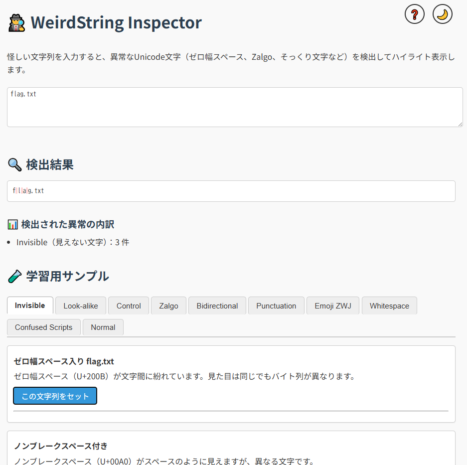

<!--
---
id: day023
slug: weirdstring-inspector

title: "WeirdString Inspector"

subtitle_ja: "Unicode異常文字検出ツール"
subtitle_en: "Unicode Anomaly Character Detector"

description_ja: "Unicode文字列に潜む異常な文字（ゼロ幅スペース、そっくり文字、制御記号など）を検出・ハイライトするWebツール。フィッシングやCTFで使われる見えない文字を可視化します。"
description_en: "A web tool that detects and highlights suspicious Unicode characters (zero-width spaces, look-alike characters, control codes, etc.) hidden in text strings. Visualizes invisible characters used in phishing and CTF challenges."

category_ja:
  - フォレンジック
  - Webセキュリティ
  - 文字列解析
category_en:
  - Forensics
  - Web Security
  - String Analysis

difficulty: 4

tags:
  - unicode
  - homoglyph
  - zero-width
  - zalgo
  - bidi
  - ctf
  - forensics
  - phishing-detection

repo_url: "https://github.com/ipusiron/weirdstring-inspector"
demo_url: "https://ipusiron.github.io/weirdstring-inspector/"

hub: true
---
-->

# 🕵️ WeirdString Inspector - Unicode異常文字検出ツール


**Day023 - 生成AIで作るセキュリティツール100**

**WeirdString Inspector** は、Unicode文字列に潜む異常な文字を検出・ハイライトするWebツールです。
ゼロ幅スペース、そっくり文字、制御記号など「見た目では気づきにくい」異常を**色分けして可視化**できます。

あなたの「見えているつもり」を裏切る、教育にもCTFにも最適な可視化ツールといえます。

---

## 🌐 デモページ

👉 [https://ipusiron.github.io/weirdstring-inspector/](https://ipusiron.github.io/weirdstring-inspector/)

---

## 📸 スクリーンショット

>
>*異常文字列を検出した*

---

## 🔍 機能一覧

- 入力文字列内の **異常文字をカテゴリ別にハイライト**
- **Unicodeコードポイント** をツールチップで確認
- **カテゴリ別に検出件数を集計表示**
- 教育用に使える **サンプル文字列** を内蔵
- すべての検出ロジックは **Setベースの精密な文字判定**
- **ダークモード対応** - 目に優しい暗いテーマに切り替え可能
- **ヘルプモーダル** - 使い方や検出カテゴリの詳細をいつでも確認

---

## 📚 検出カテゴリ一覧

| カテゴリ | 内容例 |
|----------|--------|
| Invisible（見えない文字） | ゼロ幅スペース, BOM, ノンブレークスペースなど |
| Look-alike（そっくり文字） | キリルの `а`, ギリシャの `α`, フル幅 `ａ` など |
| Control（制御文字） | RLO, タブ, CR, BEL など |
| Zalgo（結合記号） | 多重ダイアクリティカル記号での視覚妨害 |
| Bidirectional（双方向制御） | LRI, RLI, PDF などで表示順を変える |
| Punctuation（紛らわしい記号） | 全角ピリオド, クォート, 擬似記号など |
| Emoji ZWJ | ZWJ による絵文字連結（例: 👨‍💻） |
| Whitespace（空白偽装） | Hair Space, Thin Space, Narrow No-Break Spaceなど |
| Confused Scripts | アラビア文字・デーヴァナーガリーなど混在文字 |
| Normal（正常文字列） | 比較用のASCIIのみで構成された文字列 |

---

## 📖 サンプルの詳細解説

各カテゴリに含まれるサンプルの具体例とその意味・用途については、以下の解説をご覧ください。

👉 [samples.md（教育用サンプルの解説）](samples.md)

---

## 🧪 使用方法

### 基本的な使い方

1. 任意の文字列を入力、またはサンプルから選択します。
2. 異常な文字が自動でハイライト表示されます。
3. 下部にカテゴリ別の検出件数が表示されます。
4. **ヘルプボタン（❓）** をクリックすると、詳しい使い方や検出カテゴリの説明が表示されます。
5. **ダークモードボタン（🌙/☀️）** で、お好みのテーマに切り替えられます。

---

### 他ツールからの連携利用

本ツールは、他のツールからGETメソッドで呼び出すことができます：

```
https://ipusiron.github.io/weirdstring-inspector/?text={URLエンコードされた文字列}&source={呼び出し元}&attack_type={攻撃タイプ}
```

**パラメーター:**
- `text`: 解析対象の文字列（URLエンコード必須）
- `source`: 呼び出し元ツール名（例: `clipthreat-studio`）
- `attack_type`: 攻撃タイプ（任意、表示用）

**⚠️ 重要な注意事項:**
- URLパラメーターからの文字列セット機能を使用するには、**HTTPサーバー上での動作が必要**です
- 単純にローカルで`index.html`をブラウザで開いただけでは、URLパラメーターは処理されません
- ローカルテスト時は、`python -m http.server`や`npx serve`などでHTTPサーバーを起動してください

---

### 🔧 開発者向けヒント

本ツールには、内部で処理されている各文字の Unicodeコードポイントを出力するデバッグ関数が組み込まれています。
ブラウザーの開発者ツール（F12キーなどで開く）→「コンソール」タブにて、入力ごとに以下のような出力が確認できます：

```
f (U+0066), l (U+006C), a (U+0061), g (U+0067), . (U+002E), t (U+0074), x (U+0078), t (U+0074)
```

この出力は `debugCharCodes()` 関数によって実行されており、**入力された文字列の中身をコードポイント単位で確認する手段** として利用できます。

---

## 🎓 教育活用・CTF用途に

- **CTF（forensics/misc）で頻出する Unicode罠** を学ぶ教材に
- **フィッシングやなりすまし** に使われる文字列構造の可視化
- Unicodeの罠や仕様の複雑さを **視覚で体験できる教材ツール**

---

## 📁 ディレクトリ構成

```
weirdstring-inspector/
├── index.html # メインUI
├── script.js # 検出ロジック（Setベース）
├── samples.js # カテゴリ別サンプルデータ
├── style.css # スタイル定義
└── assets/
      └── screenshot.png # スクリーンショット
```

---

## 📄 ライセンス

MIT License - 詳細は[LICENSE](LICENSE)をご覧ください。

---

## 🛠 このツールについて

本ツールは、「生成AIで作るセキュリティツール100」プロジェクトの一環として開発されました。 このプロジェクトでは、AIの支援を活用しながら、セキュリティに関連するさまざまなツールを100日間にわたり制作・公開していく取り組みを行っています。

プロジェクトの詳細や他のツールについては、以下のページをご覧ください。

🔗 [https://akademeia.info/?page_id=42163](https://akademeia.info/?page_id=42163)
