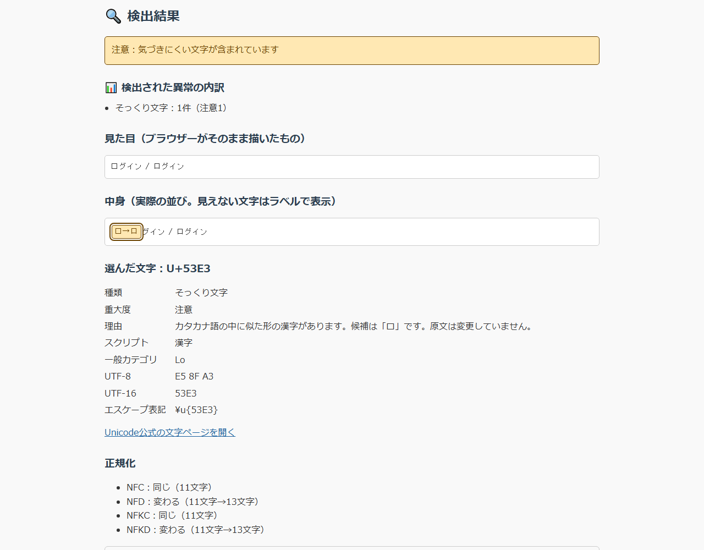
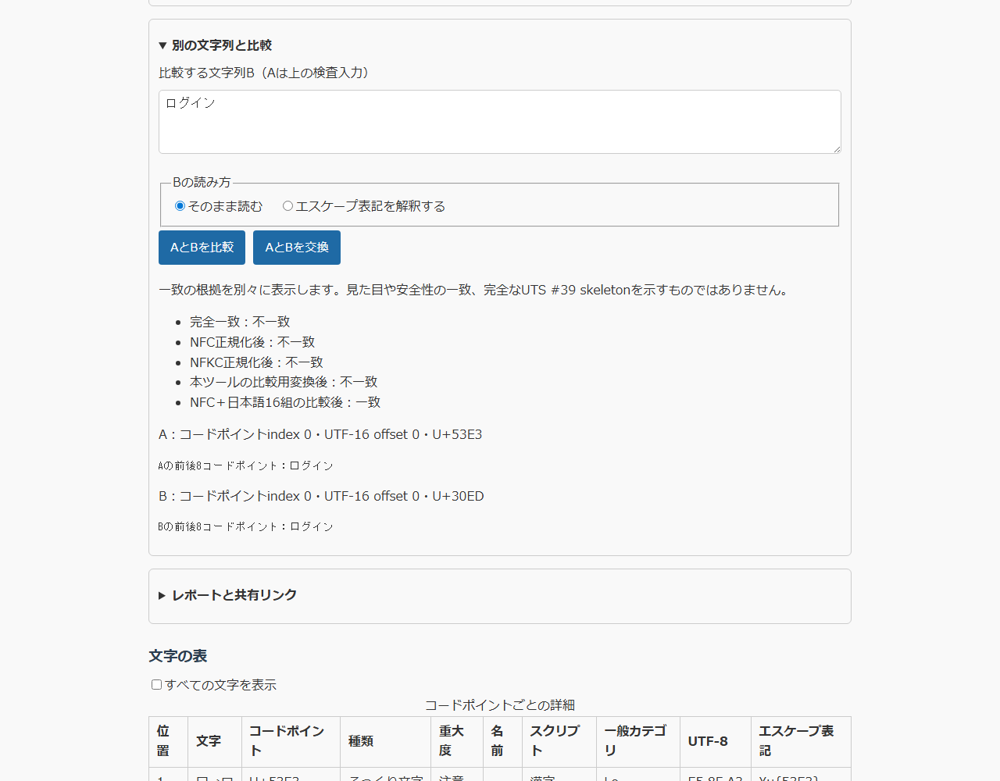
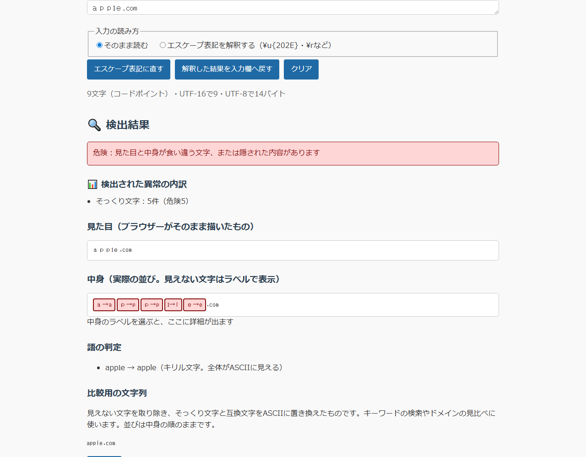

<!--
---
id: day023
slug: weirdstring-inspector

title: "WeirdString Inspector"

subtitle_ja: "Unicode異常文字検出ツール"
subtitle_en: "Unicode Anomaly Character Detector"

description_ja: "Unicode文字列に潜む異常な文字（ゼロ幅スペース、そっくり文字、制御記号など）を検出・ハイライトするWebツール。フィッシングやCTFで使われる見えない文字を可視化します。"
description_en: "A web tool that detects and highlights suspicious Unicode characters (zero-width spaces, look-alike characters, control codes, etc.) hidden in text strings. Visualizes invisible characters used in phishing and CTF challenges."

category_ja:
  - フォレンジック
  - Webセキュリティ
  - 文字列解析
category_en:
  - Forensics
  - Web Security
  - String Analysis

difficulty: 4

tags:
  - unicode
  - homoglyph
  - zero-width
  - zalgo
  - bidi
  - ctf
  - forensics
  - phishing-detection

repo_url: "https://github.com/ipusiron/weirdstring-inspector"
demo_url: "https://ipusiron.github.io/weirdstring-inspector/"

hub: true
---
-->

# WeirdString Inspector - Unicode異常文字検出ツール


[](https://ipusiron.github.io/weirdstring-inspector/)

**Day023 - 生成AIで作るセキュリティツール100**

WeirdString Inspectorは、Unicode文字列に紛れた見えない文字やそっくり文字を検出するWebツールです。
重大度と理由を示し、ブラウザーが描く「見た目」と、実際の並びである「中身」を比べられます。入力の検査はブラウザー内で完結します。

## 🌐 デモページ

👉 [https://ipusiron.github.io/weirdstring-inspector/](https://ipusiron.github.io/weirdstring-inspector/)

## 📸 スクリーンショット


> *双方向制御の見た目と中身を比べ、RLOの詳細を表示した状態*


> *画面には出ない「secret message」をタグ文字から復元した状態*


> *語の判定と比較用の文字列「apple.com」を表示した状態*


> *1枚目と同じ状態をダークモードで表示*

## ✨ 主な機能

- 12種類の文字を、危険・注意・情報の3段階で分類
- 入力した文字列の見た目と論理順の対比
- 選択した文字の理由、コードポイント、UTF-8・UTF-16、スクリプトの表示
- タグ文字や連続する異体字セレクターに隠された内容の復元
- 語単位のスクリプト判定と比較用の文字列のコピー
- NFC・NFD・NFKC・NFKDによる変化の表示
- 学習用サンプル41件（11タブ）、キーボード操作、ヘルプ、ライト・ダークテーマ
- 100,000文字（コードポイント）までの解析。中身の表示は先頭5,000文字、文字の表は最大1,000行

## 📖 使い方

1. 任意の文字列を入力するか、サンプルの「この文字列をセット」を押す。
2. 判定と種類ごとの件数を確認する。
3. 「見た目」と「中身」を比べる。中身のラベルを選ぶと、選んだ文字の理由と詳細が表示される。
4. 隠された内容・語の判定・比較用の文字列・正規化・文字の表を確認する。
5. ヘルプボタン（❓）で説明を開き、月・太陽ボタンでテーマを切り替える。

入力の読み方は「そのまま読む」が通常の設定です。「エスケープ表記を解釈する」では、`\u{202E}`や`\r`などを文字に戻して検査します。
「エスケープ表記に直す」は入力をその表記へ変えます。解釈した結果を入力欄へ戻す操作もできますが、CRがある場合は戻せません。
HTMLの入力欄がCRをLFへ変えるため、単独のCRやCRLFを含むサンプル・URL入力は、CRを失わないエスケープ表記で読み込みます。

ラベルはTabとEnterでも選べます。サンプルのタブは←→・Home・Endで移動します。ヘルプはEscで閉じ、開く前のボタンへ戻ります。
コピーを拒否する環境では画面に失敗を表示するので、文字列を選択して手動でコピーしてください。

## 📚 検出する文字の種類

| キー | 種類 | 対象 | 重大度 |
|---|---|---|---|
| tag | タグ文字 | U+E0000〜E007F。表示されず、ASCIIの文字に1対1で対応するので文を隠せる | 危険（絵文字の旗を作るものは情報） |
| bidi | 双方向制御 | 埋め込み・上書き・分離（U+202A〜202E、U+2066〜2069）と、LRM・RLM・ALM | 前者は危険、後者は注意 |
| variation | 異体字セレクター | U+FE00〜FE0F、U+E0100〜E01EFなど | 1個なら情報、2個以上の連続は危険 |
| invisible | 不可視文字 | ZWSP・ZWNJ・ZWJ・WJ・BOM・SHY・CGJ・ハングルフィラーなど | 注意。ASCIIの英数字の間なら危険。絵文字のZWJ・先頭のBOMなどは情報 |
| control | 制御文字 | C0（TAB・LF・CRLFを除く）・DEL・C1。単独のCRを含む | 注意 |
| whitespace | 特殊な空白 | U+0020以外の空白（NBSP・全角スペース・ヘアスペースなど）、U+2028・U+2029、TAB | 注意（TABは情報） |
| private | 私用領域・非文字 | 私用領域・非文字・対になっていないサロゲート | 注意 |
| zalgo | 積み重ねた結合記号 | 結合記号の5個以上の連続、または同じ結合記号の連続（UTS #39） | 注意 |
| combining | 結合記号 | 上記以外の結合記号（分解形の文など） | 情報 |
| compat | 互換文字 | NFKCでASCIIの英数字になる文字（数学用英字・丸数字・全角英数など） | 注意（全角英数は情報） |
| lookalike | そっくり文字 | confusables.txtでASCIIに見える文字 | 混在した語の中・全体がASCIIに見える語・URLの区切りに見える記号は危険、ASCIIの語の中は注意、ほかは情報 |
| mixed | スクリプトの混在 | 1つの語の中の、ほかと違うスクリプトの文字 | 危険 |

ひらがな・カタカナ・漢字・句読点・全角の記号・改行（LF・CRLF）は、単に含まれるだけでは検出しません。
ラテン文字と日本語・中国語・韓国語の組み合わせも、UTS #39のHighly Restrictiveの範囲では混在としません。
ASCIIどうしの紛らわしさ（1・l・I、0・O、rn・m）は対象外です。絵文字をつなぐ👨‍💻のZWJなど、正規の用途は情報として区別します。

## 🧭 判定の例

実物の列には、説明のために不可視文字や双方向制御文字をそのまま入れています。コピーして検査できます。

| 実物 | エスケープ表記 | 判定 | 比較用の文字列 | 説明 |
|---|---|---|---|---|
| `f​l​a​g.txt` | `f\u{200B}l\u{200B}a\u{200B}g.txt` | 危険 | `flag.txt` | ゼロ幅スペースが英数字の語を分断している |
| `abc‮txt.galf` | `abc\u{202E}txt.galf` | 危険 | `abctxt.galf` | RLOで、画面では「abcflag.txt」に見える |
| `аррӏе.com` | `\u{0430}\u{0440}\u{0440}\u{04CF}\u{0435}.com` | 危険 | `apple.com` | 全部がキリル文字で、ASCIIの「apple」に見える |
| `gооgle.com` | `g\u{043E}\u{043E}gle.com` | 危険 | `google.com` | 1語にラテン文字とキリル文字が混ざっている |
| `fun󠀠ding` | `fun\u{E0020}ding` | 危険 | `funding` | タグ文字がキーワードを分断している |
| `example。com` | `example\u{3002}com` | 危険 | `example.com` | 句点は、ブラウザーではドメイン名の「.」として扱われる |
| `こんにちは　世界` | `\u{3053}\u{3093}\u{306B}\u{3061}\u{306F}\u{3000}\u{4E16}\u{754C}` | 注意 | `\u{3053}\u{3093}\u{306B}\u{3061}\u{306F} \u{4E16}\u{754C}` | 全角スペース（「こんにちは　世界」） |
| `ありがとう。` | `\u{3042}\u{308A}\u{304C}\u{3068}\u{3046}\u{3002}` | 検出なし | `\u{3042}\u{308A}\u{304C}\u{3068}\u{3046}\u{3002}` | 日本語の普通の文（「ありがとう。」） |

## 🔗 ほかのツールからの連携

URLの`?text=`または`#text=`へ、URLエンコードした文字列を渡せます。両方にtextがあれば#側を優先します。
`source`で呼び出し元、`attack_type`で表示用の説明を指定できます。既存の?text=形式も使えます。

```text
https://ipusiron.github.io/weirdstring-inspector/?text=flag%0D.txt&source=clipthreat-studio
https://ipusiron.github.io/weirdstring-inspector/#text=abc%E2%80%AEtxt.galf&source=qr-risk-radar
```

?text=の内容は、URLの一部としてGitHub Pagesのサーバーへ送られます（アクセスログに残る可能性があります）。#text=の内容はサーバーへ送られません。
file://で開いた場合も、URLからの入力は動きます。Chromiumでクエリー・ハッシュの両方を確認しています。

連携するツールには[Day033 ClipThreat Studio](https://github.com/ipusiron/clipthreat-studio)があります。

## 🎓 教育活用・CTF用途に

- CTF（forensics/misc）で頻出するUnicode罠 を学ぶ教材に
- フィッシングやなりすまし に使われる文字列構造の可視化
- Unicodeの罠や仕様の複雑さを 視覚で体験できる教材ツール

## 📖 サンプルの詳細解説

各カテゴリに含まれるサンプルの具体例とその意味・用途については、以下の解説をご覧ください。

👉 [samples.md（教育用サンプルの解説）](samples.md)

## 🔬 技術的な説明

検出処理は`weirdstring-logic.js`に分離しています。文字ごとの一次分類、前後を見る規則、語とスクリプトの判定の順で解析します。
混在スクリプトの判定は[UTS #39の5.1・5.2](https://www.unicode.org/reports/tr39/#Mixed_Script_Detection)に沿い、ラテン文字と日本語の組み合わせは混在扱いにしません。
このツールはASCIIとの類似に対象を絞っており、UTS #39全体への適合や、あらゆるなりすましの検出を保証するものではありません。

そっくり文字の表はUnicode公式のconfusables.txt（Version 18.0.0）から生成した2,249件で、見え方は423種類です。
`node tools/build-confusables.js`で作り直し、`--check`で同梱ファイルとの差分を確認できます。
ドメイン中の全角ピリオド・句点などは、[UTS #46の区切り文字の扱い](https://www.unicode.org/reports/tr46/#Terminology)も参照しています。

スクリプトや一般カテゴリはブラウザーの正規表現（`\p{…}`）で判定するため、ブラウザーが知らない新しい文字は「その他」になりえます。
中身の表示には`unicode-bidi: bidi-override`を使い、制御文字を安全なラベルへ置き換えて論理順で並べます。双方向表示アルゴリズム自体は実装していません。

タグ文字の復元ではコードポイントからU+E0000を引きます。異体字セレクターはU+FE00〜FE0Fを0〜15、U+E0100〜E01EFを16〜255としてバイト列へ戻し、UTF-8として読める場合に文を表示します。
比較用の文字列は、不審な文字の除去や置き換えをした参考値であり、原文の代用や安全性の証明には使わないでください。

## 🔒 セキュリティ

- CSPで同一オリジンのスクリプト・CSS・画像のみを許可し、インラインのイベント・style属性を使用しない。
- referrerをno-referrerにし、外部リンクへ`rel="noopener noreferrer"`を設定する。
- ページの表示や解析で外部へ通信しない。入力した文字列をconsoleへ出力しない。
- 検査対象は`textContent`と入力欄の`value`で扱い、HTMLとして解釈しない。
- 「中身」の表示へ検査対象の制御文字をそのまま入れない。

外部リンクを押すとリンク先へ移動します。また、URLの?text=によるサーバーへの送信は、前節の注意が当てはまります。
metaのCSPではクリックジャッキングを防げません。フレームへの埋め込みを制限するには、配信側のHTTPヘッダー設定が必要です。

## 🧪 テスト

Node 22以上で、依存パッケージを追加せずに実行できます。pushとpull_requestではGitHub Actionsが自動実行します。

```sh
npm test
node tools/build-confusables.js --check
node tools/build-samples-md.js --check
```

分類、前後関係、隠された内容、双方向制御、エスケープ表記の12,167通りの往復、URL入力を検証します。
READMEの表・数値と、README・samples.mdの実物の例がエスケープ表記と一致することも検証します。
同梱した公式原本から生成したデータとの一致と、提供ファイル4点のSHA-256を確認します。

## 📁 ディレクトリー構造

```text
weirdstring-inspector/                     # 文字列に紛れた不審なUnicode文字を検出するWebツール
├── .github/                               # GitHubの設定
│   └── workflows/                         # GitHub Actionsのワークフロー
│       └── test.yml                       # pushとpull_requestでnpm testを実行
├── .gitignore                             # Git管理から除外するファイルの指定
├── .nojekyll                              # PagesのJekyll処理を無効化
├── assets/                                # READMEに載せる画像
│   ├── screenshot.png                     # Trojan Source型のサンプルを読み込んだ画面（見た目と中身の対比）
│   ├── screenshot2.png                    # タグ文字に隠した文を復元した画面
│   ├── screenshot3.png                    # キリル文字のappleを読み込んだ画面（語の判定と比較用の文字列）
│   └── screenshot4.png                    # screenshot.pngと同じ状態のダークモード
├── CLAUDE.md                              # AI向けの開発ガイド
├── index.html                             # 画面のマークアップ（入力・判定・見た目と中身・各パネル・サンプル・ヘルプ）
├── LICENSE                                # 本ツールのMITライセンス
├── package.json                           # 依存なしのnpm test定義
├── README.md                              # 本ドキュメント
├── samples.js                             # 学習用サンプル（11種類）
├── samples.md                             # サンプルの解説。コピーして試せる実物つき（tools/build-samples-md.jsの生成物）
├── script.js                              # 画面の処理（入力・表示の組み立て・タブ・ヘルプ・テーマ）
├── style.css                              # CSS変数の配色（ライト・ダーク）とレスポンシブレイアウト
├── test/                                  # node --testの自動テスト（依存なし）
│   ├── actions.test.js                    # 除去の保持条件と2文字列比較の検証
│   ├── contrast.test.js                   # 文字色と面のコントラストの検証（ライト・ダーク）
│   ├── context.test.js                    # 旗と異体字の文脈、分散した復元候補の検証
│   ├── data.test.js                       # そっくり文字の表が公式の原本から生成したものと一致することの検証
│   ├── escape.test.js                     # エスケープ表記の解釈と往復の検証
│   ├── format.test.js                     # 行長と読みやすさの検証
│   ├── html.test.js                       # CSP・ARIA・インライン属性なしの検証
│   ├── io.test.js                         # UTF-8ファイルと入出力の境界の検証
│   ├── japanese.test.js                   # 日本語16組と通常文の警告条件の検証
│   ├── logic.test.js                      # 分類・重大度・語とスクリプト・隠された内容・双方向制御の検証
│   ├── readme.test.js                     # 表（実物の例を含む）・数値・画像・ツリー・YAMLの検証
│   ├── samples.test.js                    # サンプルの判定と、samples.mdの実物がサンプルと一致することの検証
│   ├── static.test.js                     # 純粋性・禁止している書き方・辞書・CI設定の検証
│   └── url.test.js                        # URLからの入力（?text=と#text=）の検証
├── tools/                                 # 開発用のスクリプトとデータの原本（公開ページからは使わない）
│   ├── build-confusables.js               # confusables.txtからweirdstring-data.jsを作り直す（--checkで差分の確認）
│   ├── build-context-data.js              # 旗と異体字と日本語の追加データを生成
│   ├── build-samples-md.js                # samples.jsからsamples.mdを作り直す（--checkで差分の確認）
│   └── unicode/                           # Unicode公式のデータ
│       ├── confusables.txt                # UTS #39のconfusables.txt（Version 18.0.0の原本）
│       ├── context-manifest.json          # 追加データの取得元とハッシュと件数
│       ├── emoji-sequences.txt            # Unicode 18.0の絵文字列原本
│       ├── emoji-variation-sequences.txt  # Unicode 18.0の絵文字異体字原本
│       ├── StandardizedVariants.txt       # Unicode 18.0の標準異体字原本
│       └── LICENSE-UNICODE.txt            # Unicode License V3
├── weirdstring-actions.js                 # 除去と比較の純粋処理
├── weirdstring-data.js                    # ASCIIに見える文字の表（tools/build-confusables.jsの生成物）
├── weirdstring-context-data.js            # 旗と異体字と日本語16組の生成データ
├── weirdstring-logic.js                   # 画面に依存しない純粋なロジック（Nodeのテストからも読む）
└── weirdstring-messages.js                # 画面の文言の辞書と、キーから文を作る関数
```

## 💻 動作環境

現在のChromium系ブラウザーを想定しています。Python版Playwrightと、このマシンに導入済みのChromiumで、HTTP配信とfile://の両方を確認しました。
file://でindex.htmlを直接開いても、解析・サンプル・ヘルプ・URL入力・コピーが動作しました。コピーはブラウザーの権限によって拒否される場合があります。
Firefox・Safariは未検証です。

ローカルサーバーを使う場合は、リポジトリーのフォルダーで次を実行し、`http://127.0.0.1:8000/`を開きます。

```sh
python -m http.server 8000 --bind 127.0.0.1
```

## 📄 ライセンス

MIT License - 詳細は[LICENSE](LICENSE)をご覧ください。

そっくり文字の表（`weirdstring-data.js`）は、Unicode公式のconfusables.txt（Version 18.0.0）から生成したものです。
原本は`tools/unicode/`に同梱しており、[Unicode License V3](tools/unicode/LICENSE-UNICODE.txt)のもとで利用しています。© Unicode, Inc.

## 🛠️ このツールについて

本ツールは、「生成AIで作るセキュリティツール100」プロジェクトの一環として開発されました。 このプロジェクトでは、AIの支援を活用しながら、セキュリティに関連するさまざまなツールを100日間にわたり制作・公開していく取り組みを行っています。

プロジェクトの詳細や他のツールについては、以下のページをご覧ください。

🔗 [https://akademeia.info/?page_id=42163](https://akademeia.info/?page_id=42163)
